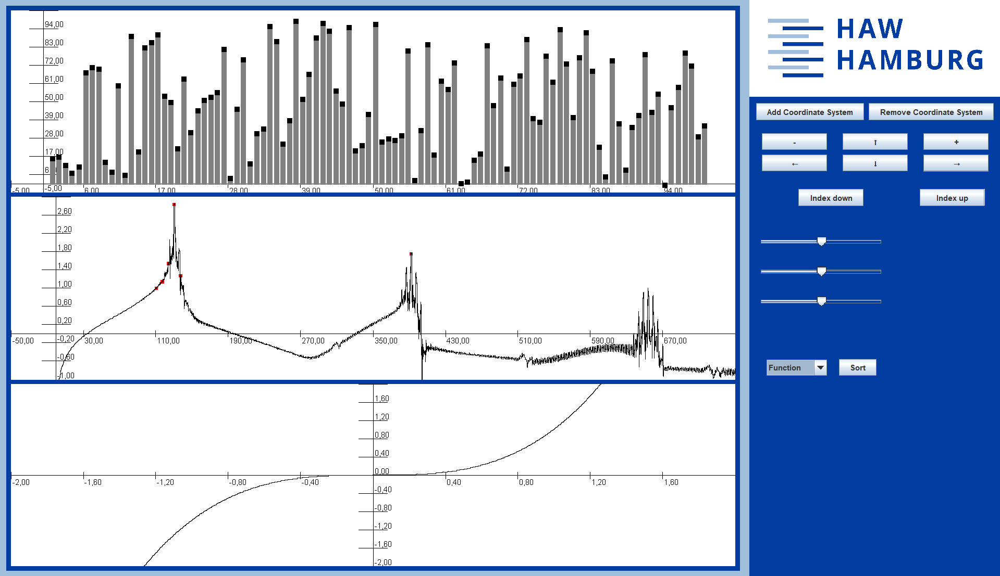
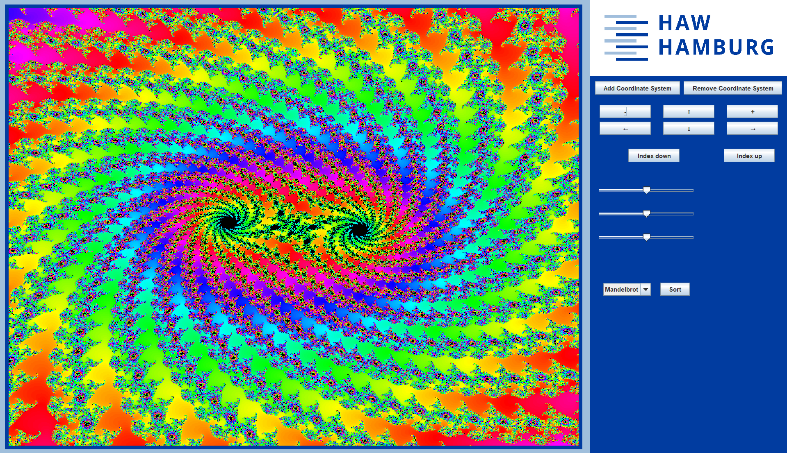
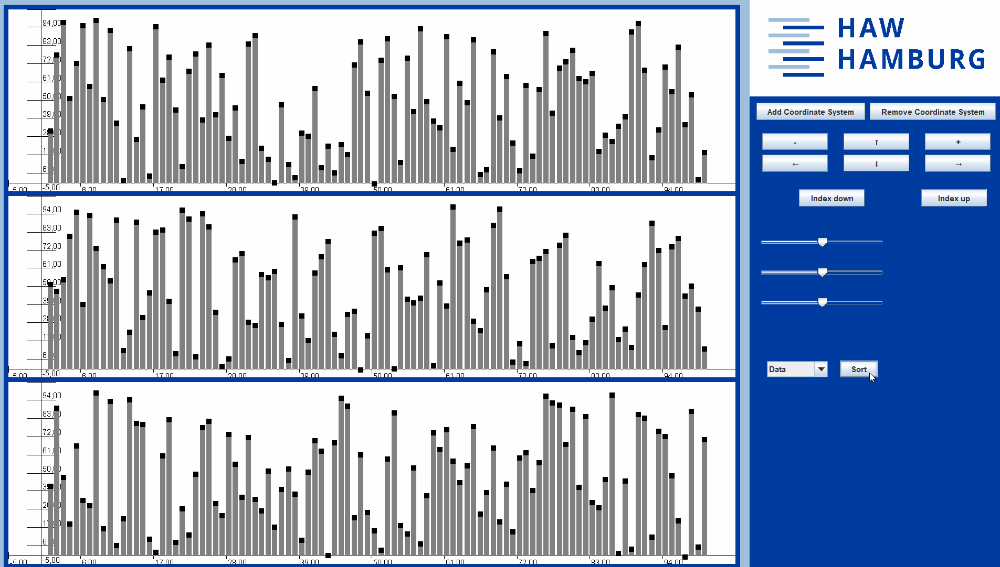

# Graph Plotter

A versatile Java-based graphing and visualization tool that enables simultaneous display of multiple coordinate systems. Create mathematical function plots, visualize sorting algorithms in real-time, analyze audio frequencies, generate fractals, and more—all within a single application.

## Features

### 📊 Mathematical Functions
- Plot various mathematical functions:
  - Polynomial functions (power functions)
  - Trigonometric functions (sine, cosine)
  - Exponential and logarithmic functions
  - Square and triangle wave approximations (Fourier series)
- Dynamic resolution adjustment based on zoom level
- Extrema detection and visualization

### 🔄 Sorting Algorithm Visualization
Real-time animated visualization of classic sorting algorithms:
- **Quick Sort**
- **Bubble Sort**
- **Insertion Sort**
- **Selection Sort**

Watch data sort in real-time with color-coded states (red for active comparisons, green for sorted elements).

### 🎵 Audio Analysis
- Load and visualize audio waveforms (WAV format)
- Fast Fourier Transform (FFT) analysis
- Dominant frequency detection
- Bandpass filtering (configurable frequency range)
- DC offset removal

### 🌀 Fractal Generation
- Mandelbrot set visualization with deep zoom capabilities
- Multi-threaded rendering for improved performance
- Adaptive iteration count based on zoom level
- Smooth coloring using HSB color space
- Optimized algorithms (cardioid/bulb checking, periodicity detection)

### 🎛️ Interactive Controls
- **Zoom In/Out**: Dynamic interval scaling
- **Pan**: Navigate in all four directions
- **Multi-panel Support**: Display up to 25 coordinate systems simultaneously
- **Index Navigation**: Switch between different graphs
- **Real-time Updates**: Live rendering and repainting

## Screenshots

### Graphing modes 

### Mandelbrot Fractal

### Sorting demonstration


## Installation

### Prerequisites
- Java Development Kit (JDK) 8 or higher
- Required libraries:
  - Apache Commons Math3
  - MigLayout

### Setup
1. Clone the repository:
```bash
git clone https://github.com/yourusername/proto-graph-plotter.git
cd proto-graph-plotter
```

2. Ensure all dependencies are in your classpath:
   - `commons-math3-x.x.jar`
   - `miglayout-x.x.jar`

3. Place audio files in the `resources/` directory for audio analysis features

4. Compile and run:
```bash
javac -d bin src/**/*.java
java -cp bin graph.Frame
```

## Usage

### Adding a Coordinate System
1. Select the desired type from the dropdown menu:
   - **Function**: Plot mathematical functions
   - **Data**: Visualize sorting algorithms
   - **Audio**: Analyze audio files with FFT
   - **Mandelbrot**: Generate fractal visualizations
   - **Fourier**: Display Fourier series approximations
   - **Node**: Visualize node-based data structures

2. Click "Add Coordinate System"

### Navigation Controls
- **Arrow Buttons** (←, →, ↑, ↓): Pan the view
- **+/- Buttons**: Zoom in/out
- **Index Up/Down**: Switch between multiple graphs
- **Sort Button**: Trigger sorting algorithm animation

### Sorting Visualization
1. Add a "Data" coordinate system
2. Click "Sort" to start the visualization
3. Watch the algorithm animate in real-time

### Audio Analysis
1. Place your WAV file in the `resources/` directory
2. Select "Audio" from the dropdown
3. The FFT analysis will display frequency spectrum with dominant frequencies highlighted in red

### Fractal Exploration
1. Select "Mandelbrot" from the dropdown
2. Use zoom controls to explore the fractal
3. The application automatically adjusts iteration count for optimal detail

## Architecture

The project follows the **Model-View-Controller (MVC)** architecture:

### Model (`data/` package)
- `DataManager`: Manages different data types and sources
- `SimpleData`: Handles point-based datasets
- `Audio`: Processes audio file data
- `FFT`: Fast Fourier Transform implementation
- `Sorting`: Sorting algorithm implementations
- `Node`, `VideoGame`: Data structure representations

### View (`graph/` package)
- `Frame`: Main application window
- `ApplicationArea`: Primary content area
- `MultiPanel`: Container for multiple coordinate systems
- `CoordinateSystem`: Individual graph panel with rendering logic
- `WidgetPanel`: Control panel with buttons and selectors
- `Axis`: Axis drawing and labeling

### Controller
- Event handlers in `WidgetPanel` and `ButtonPanel`
- Interactive controls for user input

### Utilities (`function/` package)
- `Functions`: Mathematical function implementations
- `Complex`: Complex number operations
- `Extremum`: Extrema detection

## Technical Details

### Key Technologies
- **GUI Framework**: Java Swing
- **Layout Manager**: MigLayout
- **FFT Library**: Apache Commons Math3
- **Multi-threading**: ExecutorService for parallel fractal rendering
- **Audio Processing**: Java Sound API

### Performance Optimizations
- Multi-threaded Mandelbrot rendering using thread pools
- Adaptive resolution for function plotting
- Efficient sorting visualization with configurable delay
- Buffered image rendering for complex visualizations

## Project Structure

```
proto-graph-plotter/
├── src/
│   ├── data/           # Data models and processing
│   ├── function/       # Mathematical functions
│   └── graph/          # GUI components and visualization
├── resources/          # Audio files and assets
└── README.md
```

## Dependencies

- **Apache Commons Math3**: FFT and mathematical operations
- **MigLayout**: Flexible layout management
- **Java Sound API**: Audio file processing (built-in)

## Contributing

Contributions are welcome! Please feel free to submit pull requests or open issues for bugs and feature requests.

## Acknowledgments

- Developed as part of a Formula Student car GUI application project
- Uses HAW Hamburg branding

---

**Note**: This tool was developed with a focus on educational visualization and real-time algorithm demonstration.
